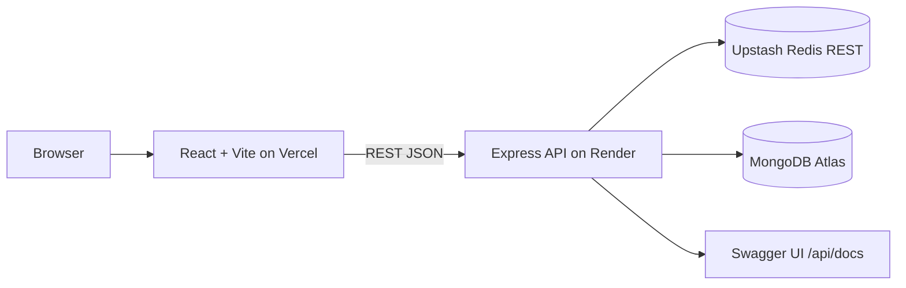

# Mahreen Explorer

Direktori karya lintas lima pilar Mahreen Indonesia. Explorer menyediakan pencarian, filter, detail karya, profil organisasi, dan API read-only. Karya seed ditautkan ke [portofolio resmi](https://mahreenindonesia.com/portofolio); profil, sejarah, dan visi-misi bersumber dari [Tentang Kami](https://mahreenindonesia.com/tentang). Statistik ditampilkan sesuai halaman portofolio dan diberi sumber agar tidak tercampur dengan metrik beranda utama.

## Arsitektur

## Menjalankan lokal

Persyaratan: Node.js 20+ dan MongoDB yang dapat diakses. Upstash opsional; API tetap berjalan tanpa Redis.

1. Salin `backend/.env.example` menjadi `backend/.env`, lalu atur `MONGODB_URI`. Tambahkan kredensial Upstash bila tersedia.
2. Jalankan `npm install` dari folder `backend/`, lalu `npm run seed` untuk mengisi atau memperbarui 5 pilar dan 10 karya portofolio (seed menggunakan upsert, tidak menghapus koleksi).
3. Jalankan `npm run dev` dari folder `backend/` (default `http://localhost:4000`). Profil organisasi tersedia di `http://localhost:4000/api/v1/about`.
4. Salin `frontend/.env.example` menjadi `frontend/.env`; sesuaikan `VITE_API_BASE_URL` bila API tidak berjalan di alamat default.
5. Jalankan `npm install` dan `npm run dev` dari folder `frontend/` (default `http://localhost:5173`).

## Environment variables

Backend (`backend/.env`):

| Nama | Fungsi |
|---|---|
| `PORT` | Port server, default `4000` |
| `MONGODB_URI` | Connection string MongoDB Atlas/lokal |
| `UPSTASH_REDIS_REST_URL` | URL Redis REST, opsional |
| `UPSTASH_REDIS_REST_TOKEN` | Token Redis REST, opsional |
| `FRONTEND_ORIGIN` | Origin frontend yang diizinkan; beberapa origin bisa dipisah koma |
| `PUBLIC_API_URL` | URL publik backend untuk Swagger `servers`, opsional |

Frontend (`frontend/.env`):

| Nama | Fungsi |
|---|---|
| `VITE_API_BASE_URL` | URL API sampai `/api/v1` |

Jangan commit file `.env` atau kredensial.

## API

Base URL: `/api/v1`

| Method & path | Fungsi |
|---|---|
| `GET /health` | Health check |
| `GET /about` | Profil, sejarah, visi-misi, legalitas, dan statistik dengan tautan sumber |
| `GET /pillars` | Daftar pilar beserta jumlah karya |
| `GET /works` | Search/filter/pagination; mendukung `q`, `pillar`, `category`, `year`, `page`, `limit` (maks. 50), `sort` (`newest`, `oldest`, `title`) |
| `GET /works/stats` | Jumlah karya total, per pilar, dan per tahun |
| `GET /works/:slug` | Detail karya |
| `GET /categories` | Kategori unik |

Dokumentasi interaktif tersedia di `/api/docs`; OpenAPI JSON di `/api/openapi.json`. Error konsisten menggunakan `{ "error": { "message": "...", "code": "..." } }`. Endpoint list memakai cache Redis 60 detik dengan fallback ke MongoDB saat cache tidak tersedia. API membatasi 100 request per 15 menit per IP.

## Deploy gratis untuk portfolio

Stack deployment: **GitHub public → Render Free API → MongoDB Atlas → Vercel Hobby frontend**. Upstash opsional dan boleh dilewati. Render Free cocok untuk demo, tetapi servicenya tidur setelah 15 menit tanpa trafik dan request pertama sesudah idle bisa membutuhkan sekitar satu menit. Vercel Hobby gratis untuk proyek personal/skala kecil. Periksa batas pemakaian dan jangan aktifkan pembayaran jika hanya ingin memakai tier gratis.

### 1. Publikasikan repository ke GitHub
- Buat repository public baru di akun GitHub, lalu hubungkan/push folder proyek ini.
- Sebelum push, pastikan hanya source code, lockfiles, README, dan `.env.example` yang masuk. `.gitignore` mengecualikan `.env`, `node_modules`, dan `dist`; jangan pernah mengunggah kredensial MongoDB.

### 2. Deploy API di Render
- Hubungkan repository GitHub ke Render sebagai Web Service. Root directory `backend`, build command `npm install`, start command `npm start`, health check `/api/v1/health`, plan Free.
- Bisa gunakan `render.yaml` sebagai Blueprint. Isi environment variables di dashboard Render: `MONGODB_URI` (Atlas), `FRONTEND_ORIGIN` (domain Vercel setelah tahap 3), dan `PUBLIC_API_URL` (URL Render tanpa slash akhir). Upstash variables opsional; Render otomatis mengatur `PORT`.
- Setelah deploy, verifikasi `/api/v1/health`, `/api/v1/about`, `/api/docs`, dan `/api/openapi.json` pada domain Render.

### 3. Seed Atlas
- Jalankan `npm run seed` dari folder `backend` lokal memakai `MONGODB_URI` Atlas di `backend/.env`. Script memakai upsert dan tidak menghapus data lain.
- Pastikan Atlas Network Access mengizinkan koneksi keluar dari service Render. Jangan salin URI atau password ke chat/repository.

### 4. Deploy frontend di Vercel
- Import repository di Vercel. Root directory `frontend`, framework Vite, build command `npm run build`, output directory `dist`.
- Tambahkan environment variable `VITE_API_BASE_URL` dengan URL API Render berakhiran `/api/v1`, lalu deploy.
- `frontend/vercel.json` sudah menyediakan rewrite SPA supaya URL detail `/karya/:slug` bisa dibuka langsung. Setelah domain Vercel didapat, isi `FRONTEND_ORIGIN` di Render dengan origin saja (contoh `https://project.vercel.app`) lalu redeploy API.

### 5. Uji submission
- Buka URL Vercel di browser private; uji pencarian, filter, detail karya, bagian Tentang dan sumbernya.
- Verifikasi link dokumentasi `https://<render-service>.onrender.com/api/docs` dan buka sebuah URL `/karya/:slug` secara langsung.
- Bagikan link frontend live, GitHub public, dan API docs kepada rekruter. Beri catatan bahwa request awal API gratis setelah idle mungkin lambat karena cold start.

## Penjelasan submission (≤150 kata)

Mahreen Explorer menyatukan karya dan program dari lima pilar Mahreen Indonesia dalam direktori yang mudah dijelajahi. Pengunjung dapat mencari berdasarkan kata kunci, memilah pilar, kategori, dan tahun, lalu membuka detail karya serta tautan menuju sumber portofolio resmi. Profil, sejarah, visi-misi, dan statistik disertai tautan ke halaman resmi terkait. Untuk posisi Web Development dengan fokus Backend, proyek ini menonjolkan REST API Express dengan validasi query Zod, pencarian dan pagination MongoDB, cache Redis TTL 60 detik, rate limiting, serta dokumentasi interaktif Swagger pada `/api/docs`. Tujuannya membantu generasi muda memahami ragam aktivitas Mahreen dan menemukan bidang yang relevan bagi mereka.

## Verifikasi

- Backend: `cd backend && npm test`
- Frontend production build: `cd frontend && npm run build`
- Integrasi: jalankan MongoDB, seed, start backend, lalu periksa `/api/v1/health`, `/api/v1/pillars`, `/api/v1/works`, `/api/v1/works/stats`, `/api/docs`, serta frontend.
