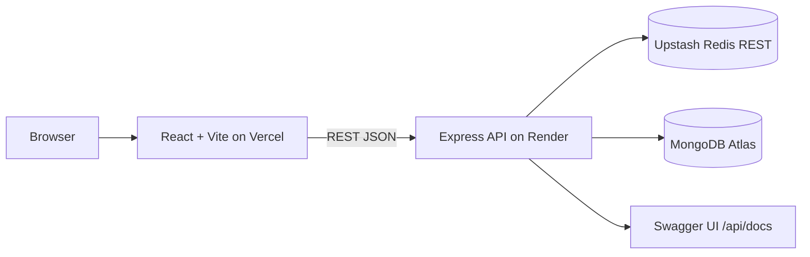

# Mahreen Explorer

Karya untuk challenge **"Berkarya Untuk Indonesia"** — Mahreen Indonesia Internship, posisi **Web Development** dengan fokus backend.

## Link live

- Frontend: [https://mahreen-explorer.vercel.app](https://mahreen-explorer.vercel.app)
- Dokumentasi API (Swagger UI): [https://mahreenexplorer.onrender.com/api/docs](https://mahreenexplorer.onrender.com/api/docs)
- Repository GitHub: (https://github.com/JakaxKato/MahreenExplorer) 

*Catatan demo: backend memakai Render Free, jadi service bisa tidur setelah 15 menit tanpa trafik; request pertama sesudah idle bisa membutuhkan sekitar satu menit.*

## Tentang proyek

Mahreen Indonesia punya banyak program, karya, dan peluang lintas divisi, tetapi informasinya tersebar sehingga sulit dikenal, dipahami, dan diikuti generasi muda. **Mahreen Explorer** adalah direktori showcase yang menyatukan karya dan profil Mahreen dalam satu ruang yang bisa dicari dan difilter dalam hitungan detik, sehingga pengunjung muda langsung menemukan jawaban: *Mahreen ini bergerak di bidang apa saja, dan mana yang relevan buat saya?*

Masalah yang dijawab bukan sekadar tampilan, melainkan **arsitektur informasi** — lima pilar dengan puluhan karya butuh sistem pencarian, filter, dan pagination yang solid. Itulah fokus backend proyek ini, sementara frontend tetap dirancang dekat dengan audiens muda.

## Fitur utama

Untuk pengunjung:

- **Pencarian instan** dengan debounce 400 ms terhadap judul dan deskripsi karya
- **Filter kombinasi** berdasarkan pilar, kategori, dan tahun, plus pengurutan dan pagination
- **Halaman detail karya** dengan tautan ke sumber portofolio dan halaman pilar resmi
- **Profil Mahreen Indonesia**: sejarah, visi-misi, kepemimpinan, legalitas, dan statistik yang selalu disertai tautan sumber
- State lengkap: loading, empty, error, dan fallback saat sebagian data belum tersedia

Sorotan backend (pembeda submission ini):

- **REST API** Node.js + Express di base URL `/api/v1`, kontrak terdokumentasi penuh di Swagger UI dan OpenAPI JSON
- **Validasi query Zod** sebelum menyentuh database: halaman dan limit harus angka positif, tahun valid, pilar harus slug terdaftar — input tidak valid ditolak dengan kode `VALIDATION_ERROR`
- **Pencarian teks dan indeks MongoDB** di judul, deskripsi, pilar, kategori, dan tahun agar filter tetap cepat
- **Cache Redis via Upstash** dengan key dari parameter yang tervalidasi, TTL 60 detik, dan fallback otomatis ke MongoDB saat cache tidak tersedia — API read-only sehingga tidak butuh logika invalidasi
- **Rate limiting** 100 request per 15 menit per IP, **CORS** berbasis daftar origin frontend, logging request, dan format error konsisten `{ "error": { "message", "code" } }`

## Arsitektur

Alur request pencarian: `Client → Express route → validasi Zod → cek cache Redis (key = hash query params) → jika miss, query MongoDB dengan filter + text search → simpan ke cache (TTL 60 detik) → return JSON`.

## API

Base URL: `/api/v1`

| Method & path | Fungsi |
|---|---|
| `GET /health` | Health check |
| `GET /about` | Profil, sejarah, visi-misi, legalitas, dan statistik dengan tautan sumber |
| `GET /pillars` | Daftar pilar beserta jumlah karya |
| `GET /works` | Search/filter/pagination; mendukung `q`, `pillar`, `category`, `year`, `page`, `limit` (maks. 50), `sort` (`newest`, `oldest`, `title`) |
| `GET /works/stats` | Jumlah karya total, per pilar, dan per tahun |
| `GET /works/:slug` | Detail karya |
| `GET /categories` | Kategori unik |

Dokumentasi interaktif tersedia di `/api/docs`; OpenAPI JSON di `/api/openapi.json`. Endpoint list memakai cache Redis 60 detik dengan fallback ke MongoDB saat cache tidak tersedia. API membatasi 100 request per 15 menit per IP.

## Kredibilitas data

Semua karya ditautkan ke [portofolio resmi](https://mahreenindonesia.com/portofolio); profil, sejarah, dan visi-misi bersumber dari [Tentang Kami](https://mahreenindonesia.com/tentang). Statistik ditampilkan sesuai halaman portofolio dan diberi keterangan sumber agar tidak tercampur dengan metrik beranda utama.

## Penjelasan submission (≤150 kata)

Mahreen Explorer menyatukan karya dan program dari lima pilar Mahreen Indonesia dalam direktori yang mudah dijelajahi. Pengunjung dapat mencari berdasarkan kata kunci, memilah pilar, kategori, dan tahun, lalu membuka detail karya serta tautan menuju sumber portofolio resmi. Profil, sejarah, visi-misi, dan statistik disertai tautan ke halaman resmi terkait. Untuk posisi Web Development dengan fokus Backend, proyek ini menonjolkan REST API Express dengan validasi query Zod, pencarian dan pagination MongoDB, cache Redis TTL 60 detik, rate limiting, serta dokumentasi interaktif Swagger pada `/api/docs`. Tujuannya membantu generasi muda memahami ragam aktivitas Mahreen dan menemukan bidang yang relevan bagi mereka.

---

## Untuk pengembang

Bagian ini hanya untuk reproduksi dan pemeliharaan; reviewer tidak perlu membacanya.

### Menjalankan lokal

Persyaratan: Node.js 20+ dan MongoDB yang dapat diakses. Upstash opsional; API tetap berjalan tanpa Redis.

1. Salin `backend/.env.example` menjadi `backend/.env`, lalu atur `MONGODB_URI`. Tambahkan kredensial Upstash bila tersedia.
2. Jalankan `npm install` dari folder `backend/`, lalu `npm run seed` untuk mengisi atau memperbarui 5 pilar dan 10 karya portofolio (seed menggunakan upsert, tidak menghapus koleksi).
3. Jalankan `npm run dev` dari folder `backend/` (default `http://localhost:4000`). Profil organisasi tersedia di `http://localhost:4000/api/v1/about`.
4. Salin `frontend/.env.example` menjadi `frontend/.env`; sesuaikan `VITE_API_BASE_URL` bila API tidak berjalan di alamat default.
5. Jalankan `npm install` dan `npm run dev` dari folder `frontend/` (default `http://localhost:5173`).

### Environment variables

Backend (`backend/.env`):

| Nama | Fungsi |
|---|---|
| `PORT` | Port server, default `4000` |
| `MONGODB_URI` | Connection string MongoDB Atlas/lokal |
| `UPSTASH_REDIS_REST_URL` | URL Redis REST, opsional |
| `UPSTASH_REDIS_REST_TOKEN` | Token Redis REST, opsional |
| `FRONTEND_ORIGIN` | Origin frontend yang diizinkan; beberapa origin bisa dipisah koma |
| `PUBLIC_API_URL` | URL publik backend untuk Swagger `servers`, opsional |

Frontend (`frontend/.env`):

| Nama | Fungsi |
|---|---|
| `VITE_API_BASE_URL` | URL API sampai `/api/v1` |

Jangan commit file `.env` atau kredensial.

### Deployment yang dipakai

Stack live: **GitHub public → Render Free API → MongoDB Atlas → Vercel Hobby frontend**. Upstash opsional.

- **Render**: Web Service dari folder `backend`, build `npm install`, start `npm start`, health check `/api/v1/health`, plan Free. Environment: `MONGODB_URI`, `FRONTEND_ORIGIN` (origin Vercel), `PUBLIC_API_URL`. Blueprint tersedia di `render.yaml`. Seed Atlas dijalankan dari lokal karena seed upsert aman diulang; pastikan Network Access Atlas mengizinkan koneksi service.
- **Vercel**: import repo, root directory `frontend`, build `npm run build`, output `dist`. Set `VITE_API_BASE_URL` (tipe Config, environment Production) ke URL API berakhiran `/api/v1`, lalu redeploy karena perubahan environment hanya berlaku untuk deployment berikutnya. `frontend/vercel.json` menangani rewrite SPA untuk `/karya/:slug`.
- Perhatikan batas tier gratis: jangan aktifkan pembayaran bila hanya untuk demo, dan periksa kuota Render.

### Verifikasi

- Backend: `cd backend && npm test`
- Frontend production build: `cd frontend && npm run build`
- Integrasi: jalankan MongoDB, seed, start backend, lalu periksa `/api/v1/health`, `/api/v1/pillars`, `/api/v1/works`, `/api/v1/works/stats`, `/api/docs`, serta frontend.
